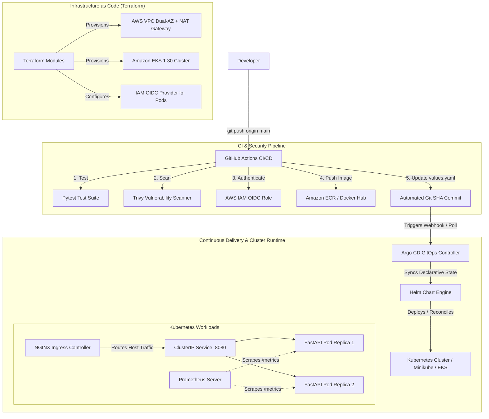

# Cloud-Native Health Monitor

A production-grade, GitOps-driven microservice and infrastructure platform demonstrating automated delivery, shift-left container security, and modular Infrastructure as Code (IaC) on Kubernetes and AWS.

---

## Architecture Overview



---

## Key Technical Features

* **Microservice Architecture:** FastAPI-based asynchronous HTTP health monitor polling configured endpoints with configurable timeouts, exporting native Prometheus metrics (`/metrics`), liveness probes (`/healthz`), and readiness probes (`/ready`).
* **Shift-Left Security:** Automated Trivy container vulnerability scanning in GitHub Actions configured to catch `HIGH` and `CRITICAL` CVEs before image publication.
* **Keyless AWS Authentication:** Pipeline uses GitHub Actions OIDC federation to assume IAM roles dynamically, eliminating long-lived AWS Access Keys.
* **Declarative Packaging:** Parameterized Helm chart supporting configurable replica counts, CPU/memory resource requests and limits, ingress hosts, and environment overrides.
* **GitOps Continuous Delivery:** Argo CD manages cluster state with automated synchronization, self-healing, and automated pruning. The CI pipeline patches `charts/health-monitor/values.yaml` with the exact Git commit SHA on every release, achieving zero-touch rolling updates.
* **Modular Infrastructure as Code:** Terraform configuration structuring a dedicated multi-AZ AWS VPC with public/private subnets, managed NAT Gateway, Kubernetes ELB discovery tagging, managed EKS node groups, and IAM Roles for Service Accounts (IRSA).

---

## Tech Stack

| Layer | Technologies |
| :--- | :--- |
| **Application Runtime** | Python 3.11, FastAPI, Uvicorn, Requests |
| **Observability** | Prometheus Client Library, Kubernetes Probes |
| **Containerization** | Docker, Multi-stage Slim Builds |
| **Security Scanning** | Aqua Security Trivy, AWS IAM OIDC |
| **Packaging & Ingress** | Helm v3, NGINX Ingress Controller |
| **Continuous Delivery** | Argo CD (GitOps), GitHub Actions |
| **Cloud Infrastructure** | AWS (VPC, Subnets, NAT, ECR, EKS 1.30, IAM, IRSA), Terraform |

---

## Repository Structure

```text
├── .github/workflows/
│   └── ci-cd.yaml             # CI pipeline: Pytest, Trivy scan, ECR push, GitOps commit
├── app/
│   ├── main.py                # FastAPI microservice logic & Prometheus metrics
│   ├── monitor.py             # Asynchronous endpoint health checker
│   ├── requirements.txt       # Production dependencies
│   └── test_requirements.txt  # Testing dependencies
├── charts/
│   └── health-monitor/        # Parameterized Helm chart
│       ├── Chart.yaml
│       ├── values.yaml        # Dynamically patched by CI pipeline
│       └── templates/         # Deployment, Service, Ingress, ConfigMap manifests
├── argocd/
│   └── application.yaml       # Argo CD declarative application manifest
├── terraform/
│   ├── modules/
│   │   ├── vpc/               # Reusable VPC, NAT, Route Tables, and Subnet module
│   │   └── eks/               # EKS cluster, Managed Node Group, and OIDC module
│   └── environments/
│       └── dev/               # Environment composition and provider definitions
└── tests/
    └── test_main.py           # Unit and mock integration test suite
```

---

## Local Quick Start

### 1. Prerequisites
* Docker Desktop & Minikube installed
* Helm v3 CLI installed
* kubectl and AWS CLI configured

### 2. Deploy Locally via Helm & Ingress
```powershell
# Start Minikube & Enable Ingress
minikube start
minikube addons enable ingress

# In a separate admin window, start tunnel:
minikube tunnel

# Deploy the Helm Chart
helm upgrade --install health-monitor ./charts/health-monitor

# Verify ingress routing
curl -H "Host: health-monitor.local" [http://127.0.0.1/healthz](http://127.0.0.1/healthz)
```

### 3. Deploy via Argo CD (GitOps)
```powershell
# Install Argo CD
kubectl create namespace argocd
kubectl apply -n argocd --server-side -f [https://raw.githubusercontent.com/argoproj/argo-cd/stable/manifests/install.yaml](https://raw.githubusercontent.com/argoproj/argo-cd/stable/manifests/install.yaml)

# Apply the GitOps Application
kubectl apply -f argocd/application.yaml

# Port-forward the web UI
kubectl port-forward svc/argocd-server -n argocd 8443:443
```

---

## Provisioning Cloud Infrastructure (Terraform)

```powershell
cd terraform/environments/dev

# Initialize providers and modules
terraform init

# Review execution plan
terraform plan

# (Optional) Apply to AWS EKS
terraform apply -auto-approve

# Tear down infrastructure
terraform destroy -auto-approve
```